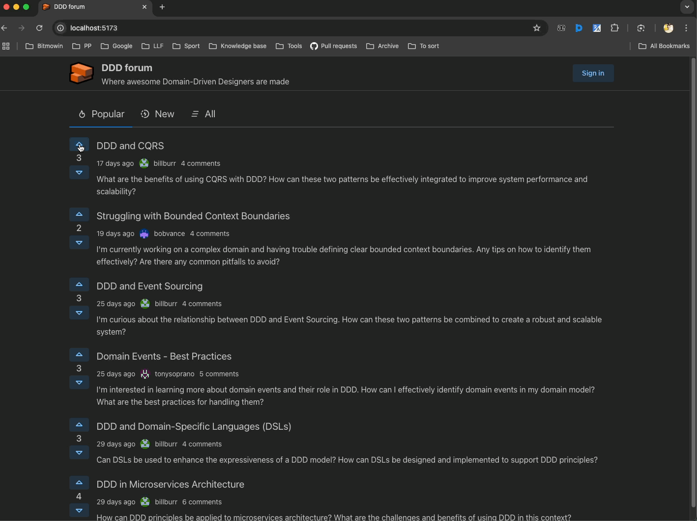

# Code first assignment 2nd attempt

- https://www.essentialist.dev/products/the-software-essentialist/categories/2154344001/posts/2168948146
- https://www.essentialist.dev/products/the-software-essentialist/categories/2154344011/posts/2173535677
- PR: https://github.com/karpov-kir/the-software-essentialist-course/pull/9

## API

- `POST /users/sign-up`: Sign up ([SignUpDto](./packages/shared/src/dtos/UserDto.ts))
- `POST /users/sign-in`: Sign in ([SignInDto](./packages/shared/src/dtos/UserDto.ts))
- `GET /users/me`: Get the currently signed in user
- `GET /posts`: Get all posts ([PostPreviewDto](./packages/shared/src/dtos/PostDto.ts))
- `GET /posts/:id?filter=<filter>`: Get a post by id ([PostDetailDto](./packages/shared/src/dtos/PostDto.ts))
  - `filter` - `new` | `popular` | `all` (default)
- `POST /posts/:id/upvote`: Upvote a post using the currently signed in member
- `POST /posts/:id/downvote`: Downvote a post using the currently signed in member
- `DELETE /posts/:id/vote`: Delete votes from the post of the currently signed in member
- `POST /comments/:id/upvote`: Upvote a comment using the currently signed in member
- `POST /comments/:id/downvote`: Downvote a comment using the currently signed in member
- `DELETE /comments/:id/vote`: Delete votes from the comment of the currently signed in member

## How to start locally

- `npm ci`
- `npm run db:migrate`
- `npm run db:seed` (it removes all records and creates new ones)
- `npm run start:dev:backend`
- `npm run start:dev:frontend`

## Examples

```bash
# This command will create a new user and return a token
curl -X POST http://localhost:3000/users/sign-up -H "Content-Type: application/json" \
  -d '{"email": "test@mail.com", "username": "test", "password": "test", "firstName": "Test", "lastName": "Test"}'

# This command will return a token
curl -X POST http://localhost:3000/users/sign-in -H "Content-Type: application/json" \
  -d '{"username": "test", "password": "test"}'

curl -X GET http://localhost:3000/users/me -H "Authorization: Bearer <token>"

curl -X GET http://localhost:3000/posts

curl -X GET http://localhost:3000/posts/:id

curl -X POST http://localhost:3000/posts/:id/upvote -H "Authorization: Bearer <token>"
```

## Demo


