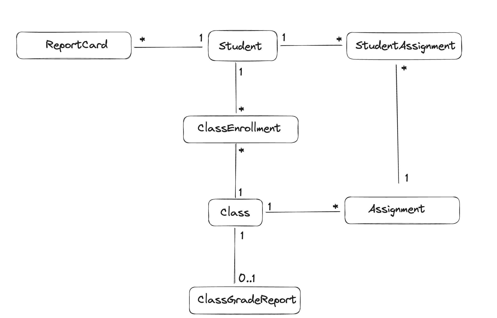

# Refactoring to 4 Tiers architecture (unsafely)

- Assignment: https://www.essentialist.dev/products/the-software-essentialist/categories/2155097981/posts/2176565064
- PR: https://github.com/karpov-kir/the-software-essentialist-course/pull/11

## Conventions

- Modules can import from other modules only from `exports.ts` files (e.g. `import { AssignmentRepository } from '../assignments/exports'`)

## Getting started

- `npm ci`
- `npm run start:dev`
- You can access the application at `http://localhost:3000`
- You can interact with the API through any API client like Postman, Insomnia or your CLI

## Database schema

The database schema is as follows:



## API

- Create a new student

```bash
curl -X POST http://localhost:3000/students \
  -H "Content-Type: application/json" \
  -d '{
    "name": "John Doe"
  }'
```

- Get all students

```bash
curl http://localhost:3000/students
```

- Get a student by ID

```bash
curl http://localhost:3000/students/{studentId}
```

- Create a new class

```bash
curl -X POST http://localhost:3000/classes \
  -H "Content-Type: application/json" \
  -d '{
    "name": "Mathematics 101"
  }'
```

- Enroll a student in a class

```bash
curl -X POST http://localhost:3000/class-enrollments \
  -H "Content-Type: application/json" \
  -d '{
    "studentId": "student-uuid",
    "classId": "class-uuid"
  }'
```

- Create a new assignment

```bash
curl -X POST http://localhost:3000/assignments \
  -H "Content-Type: application/json" \
  -d '{
    "classId": "class-uuid",
    "title": "Final Exam"
  }'
```

- Assign a student to an assignment

```bash
curl -X POST http://localhost:3000/student-assignments \
  -H "Content-Type: application/json" \
  -d '{
    "studentId": "student-uuid",
    "assignmentId": "assignment-uuid"
  }'
```

- Get a student's assignments

```bash
curl http://localhost:3000/student/{studentId}/assignments
```

- Submit a student's assignment

```bash
curl -X POST http://localhost:3000/student-assignments/submit \
  -H "Content-Type: application/json" \
  -d '{
    "id": "student-assignment-uuid"
  }'
```

- Grade a student's assignment

```bash
curl -X POST http://localhost:3000/student-assignments/grade \
  -H "Content-Type: application/json" \
  -d '{
    "studentAssignmentId": "student-assignment-uuid",
    "grade": "A"
  }'
```

- Get a student's grades

```bash
curl http://localhost:3000/student/{studentId}/grades
```

- Get a class's assignments

```bash
curl http://localhost:3000/classes/{classId}/assignments
```

- Get an assignment by ID

```bash
curl http://localhost:3000/assignments/{assignmentId}
```
